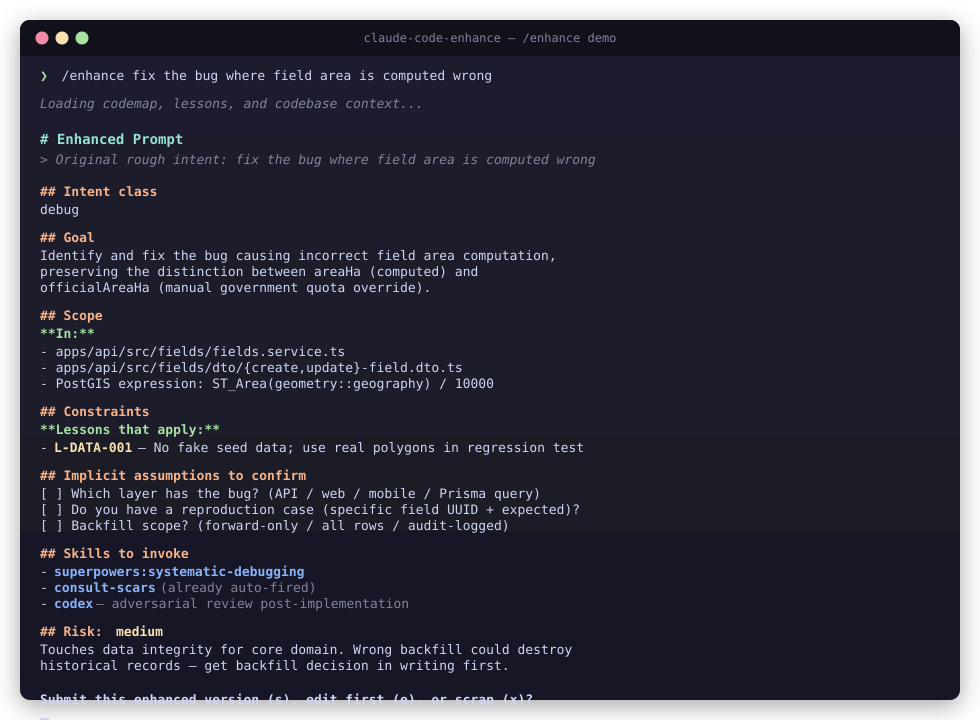

# claude-code-enhance

> Augment-style prompt enhancer + scar-tissue lesson library + project codemap for [Claude Code](https://claude.com/claude-code). Free, local, MIT-licensed.

**English** · [简体中文](docs/i18n/README.zh-CN.md) · [日本語](docs/i18n/README.ja.md) · [한국어](docs/i18n/README.ko.md) · [Русский](docs/i18n/README.ru.md)



Three skills that work together to make your AI coding agent behave more like a distinguished engineer who's been on your codebase for 18 months — instead of a smart consultant who just walked in.

```
                    Your rough intent
                          │
                          ▼
        ┌─────────────────────────────────┐
        │  /enhance — Prompt Enhancer     │  ← lifts vague thought into structured prompt
        │  Codebase-aware, lesson-cited   │     with goal/scope/constraints/success criteria
        └─────────────────────────────────┘
                          │
                          ▼
              You review → submit / edit / scrap
                          │
                          ▼
        ┌─────────────────────────────────┐
        │  consult-scars — Lesson Library │  ← cross-references past mistakes (auto-fires
        │  Domain-keyed scar tissue       │     on architectural verbs in your prompt)
        └─────────────────────────────────┘
                          │
                          ▼
        ┌─────────────────────────────────┐
        │  Project codemap (optional)     │  ← architecture/hotfiles/recent injected
        │  refreshed via /refresh-codemap │     on SessionStart for projects that have it
        └─────────────────────────────────┘
```

## What you get

| Skill                   | What it does                                                                                                       | When it fires                                                                                 |
| ----------------------- | ------------------------------------------------------------------------------------------------------------------ | --------------------------------------------------------------------------------------------- |
| `/enhance <rough idea>` | Loads codebase context, applies prompt engineering principles, produces a structured prompt you review/edit/submit | User-controlled (you type it)                                                                 |
| `consult-scars`         | Loads relevant lessons from your scar-tissue library before producing architectural plans                          | Auto-fires on prompts containing `design`, `refactor`, `migrate`, `add caching`, `auth`, etc. |
| `/refresh-codemap`      | Regenerates `hotfiles.md` and `recent.md` from git history for the current project                                 | User-controlled (run weekly or before major work)                                             |

Plus optional infrastructure (lessons library, codemap, SessionStart hooks) that the skills use when present and gracefully skip when not.

## Why this exists

Existing alternatives have real downsides for solo devs and small teams:

|                                   | claude-code-enhance                         | Augment Code                      | claude-mem                            |
| --------------------------------- | ------------------------------------------- | --------------------------------- | ------------------------------------- |
| **License**                       | MIT                                         | Proprietary                       | AGPL-3.0 (commercial poison)          |
| **Cost**                          | $0 (uses your existing Claude Code session) | Credits per query, opaque pricing | API tokens for compression            |
| **Privacy**                       | All local, never leaves machine             | Optional cloud mode               | Local SQLite + Chroma                 |
| **Lock-in**                       | None — fork freely                          | Augment infrastructure            | AGPL viral copyleft                   |
| **Codebase-aware**                | Yes (codemap + Serena + grep)               | Yes                               | Indirect (compressed summaries)       |
| **Cross-references past lessons** | Yes (built-in scar tissue library)          | No                                | No (auto-captures everything instead) |
| **Visible enhanced prompt**       | Yes (you review/edit/scrap)                 | Yes (Ctrl+P → buffer replaced)    | N/A (different tool)                  |
| **Trust model**                   | Plain markdown you can audit                | Black-box service                 | AI-compressed summaries               |

The philosophy: **curated > captured.** Quality of memory matters infinitely more than quantity. A senior engineer's notebook is thin and authoritative; a junior's is overflowing and unreliable. This plugin is the thin notebook.

## Quick start

### Option 1 — Plugin marketplace (recommended once published)

```bash
# In Claude Code:
/plugin marketplace add <YOUR-GITHUB-USER>/claude-code-enhance
/plugin install claude-code-enhance
```

### Option 2 — Manual install

```bash
# Clone the repo
git clone https://github.com/<YOUR-GITHUB-USER>/claude-code-enhance.git
cd claude-code-enhance

# Copy skills to your Claude Code skills dir
mkdir -p ~/.claude/skills
cp -r skills/enhance      ~/.claude/skills/
cp -r skills/consult-scars  ~/.claude/skills/
cp -r skills/refresh-codemap ~/.claude/skills/

# Restart Claude Code — skills appear in /skills list
```

### Option 3 — Full install with optional infrastructure

```bash
# Clones + installs skills + bootstraps lesson library + sets up SessionStart hooks
bash scripts/bootstrap.sh
```

The bootstrap script is idempotent — safe to re-run. See `scripts/bootstrap.sh` for what it does.

## Usage

### Enhance a vague prompt

```
/enhance fix the bug where field area is computed wrong
```

The agent loads codebase context (your `.codemap/`, your `~/.claude/lessons/`, project `CLAUDE.md`, Serena MCP if present, recent git activity), applies prompt engineering principles, and shows you a structured enhanced prompt. You can:

- **submit** (`s`) — proceed with the enhanced version as the actual instruction
- **edit** (`e`) — revise before submission
- **scrap** (`x`) — fall back to your original rough intent

### Add a lesson when something burns

When you discover a non-obvious gotcha mid-work, write a lesson immediately while the pain is fresh:

```
~/.claude/lessons/<domain>.md
```

Use the format documented in `examples/lessons/README.md`. Stable IDs (`L-AUTH-001`, `L-NESTJS-002`) are referenceable from CodeRabbit configs, PR descriptions, and Slack/Telegram pings.

### Bootstrap a project's codemap

```
cd <your-project>
mkdir .codemap
/refresh-codemap
# Then hand-write .codemap/overview.md based on what you know
```

The auto-generated parts (`hotfiles.md` from git change frequency, `recent.md` from last 30 days) refresh automatically. The hand-written `overview.md` only changes when your architecture genuinely changes.

## Architecture

```
claude-code-enhance/
├── .claude-plugin/
│   └── plugin.json          # Claude Code plugin manifest
├── skills/
│   ├── enhance/SKILL.md             # /enhance — prompt enhancer
│   ├── consult-scars/SKILL.md       # auto-fires lesson loader
│   └── refresh-codemap/SKILL.md     # /refresh-codemap — git-derived heat map
├── hooks/
│   ├── inject-global-memory.sh      # SessionStart: loads ~/.claude/memory/_global/
│   └── inject-project-codemap.sh    # SessionStart: loads <project>/.codemap/ if present
├── scripts/
│   └── bootstrap.sh                 # idempotent install of optional infrastructure
├── examples/
│   ├── lessons/                     # example lesson library (auth, api-design, etc.)
│   └── codemap/                     # example project codemap (overview/hotfiles/recent)
├── README.md                        # this file
├── LICENSE                          # MIT
└── .gitignore
```

## Optional companions

This plugin works best with these complementary tools (all free):

- **[Serena MCP](https://github.com/oraios/serena)** — LSP-backed semantic codebase queries. The `/enhance` skill calls Serena's `find_symbol` and `get_symbol_overview` to identify exact file paths instead of guessing.
- **[Anthropic prompt engineering guide](https://docs.anthropic.com/en/docs/build-with-claude/prompt-engineering)** — the principles the `/enhance` skill applies.

## Contributing

Issues and PRs welcome. Specifically interested in:

- Additional default lesson domains (e.g., `mobile.md`, `payments.md`, `observability.md`)
- Per-stack codemap generators (Python, Go, Rust)
- Improvements to the `/enhance` system prompt
- Localization of skill descriptions

## License

MIT. See [LICENSE](LICENSE).

## Acknowledgments

- Inspired by [Augment Code's prompt enhancer](https://docs.augmentcode.com/cli/interactive/prompt-enhancer)
- Built with [Claude Code](https://claude.com/claude-code) — including this plugin itself
